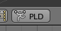

# Miscellaneous Tools for Blender

To install any of the following add-ons, go to `File > User Preferences... > Add-ons`,
click on the `Install from File...` button at the bottom of the window,
then select the corresponding `*.py` file. The add-on description will be
shown alone in the list, but inactive. Click on the checkbox to activate it,
and finally click on the `Save User Settings` to keep it active for the
next time Blender is started.

### Point-Light Display Creator


`PLD_creator.py`: Quickly creates a Point-Light Display with spheres
attached to an armature's bones. The spheres are shaded with the "pure white"
material, which is created if necessary.

To create a PLD, select an armature in pose mode, then click on the
PLD button in the 3D View:



### Ultra Coder

`ultra-coder.py`: This add-on was created as a better alternative to the old
[SuperCoder](https://sourceforge.net/projects/supercoder/). It allows one
to easily annotate events in a video recording and import/export the
corresponding markers. A set of buttons is added to the sequencer toolbar:


The semantics of the buttons in the default configuration (shown above) and
their corresponding markers is as follows:
* `vL`: subject's gaze directed to the left of the video, i.e. egocentric right;
shortcut `4` in the numeric keypad.
* `C`: subject's gaze directed to the center of the video; shortcut `5`.
* `QR`: marker for scanning QR codes, for video synchronization; shortcut `1`.
* `DTMF`: marker for scanning DTMF codes, for audio synchronization; shortcut `2`.
* `A`: subject is distracted/looking away; shortcut `8`.
* `vR`: subject is looking to the right side of the video, i.e. egocentric left;
shortcut `6` in the numeric keypad.

The rightmost buttons respectively import and export the markers in the
timeline. The file format is a simple CSV with the frame number and its marker.
For example, the following timeline results in the CSV file bellow
(the frame rate was kept at the default 24 fps):


```
60,QR
72,QR
82,A
93,vR
```

It is possible to configure Ultra Coder to show different buttons, just
create a `.ultra-coder.json` file in the home folder with the buttons'
specification. The default configuration is:

```json
[
  ["TRIA_LEFT", "vL", "NUMPAD_4"],
  ["FULLSCREEN_EXIT", "C", "NUMPAD_5"],
  ["BORDERMOVE", "QR", "NUMPAD_1"],
  ["SOUND", "DTMF", "NUMPAD_2"],
  ["FREEZE", "A", "NUMPAD_8"],
  ["TRIA_RIGHT", "vR", "NUMPAD_6"]
]```

Each button needs three items: an icon name (check the
[Display_All_Icons](https://wiki.blender.org/index.php/Extensions:2.6/Py/Scripts/Development/Display_All_Icons) add-on for the full list), the marker label, and a
shortcut key. To disable the shortcut, use the empty string `""`.


## Acknowledgments

The scripts in this bundle were developed with financial support from the
Foundation for Science and Technology of Portugal (FCT),
under the grant PTDC/MHC-PCN/1530/2014.
